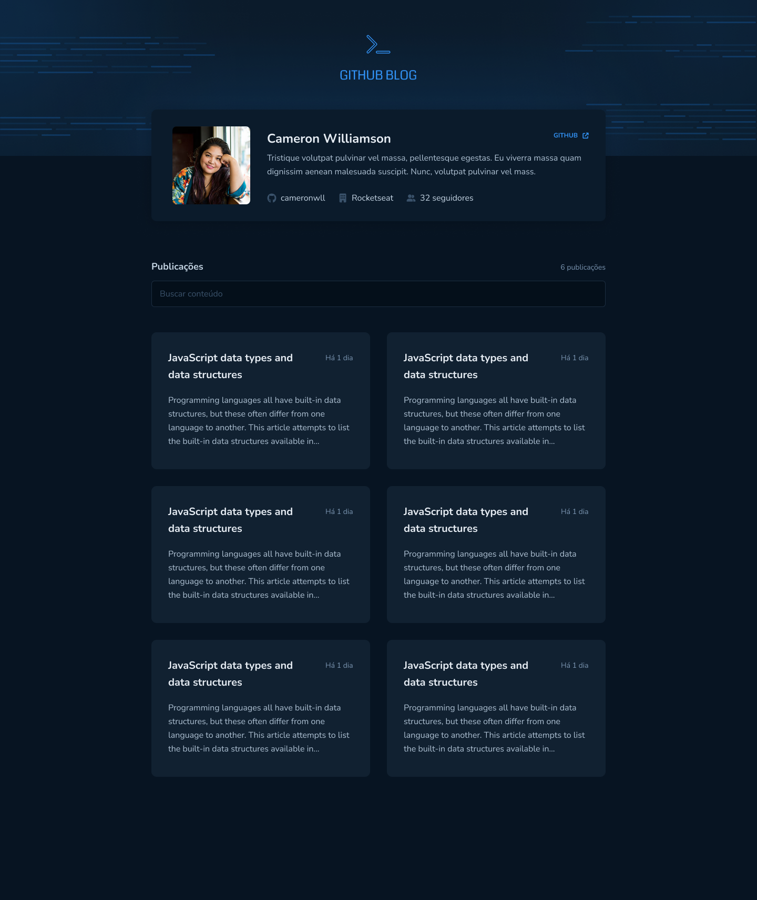
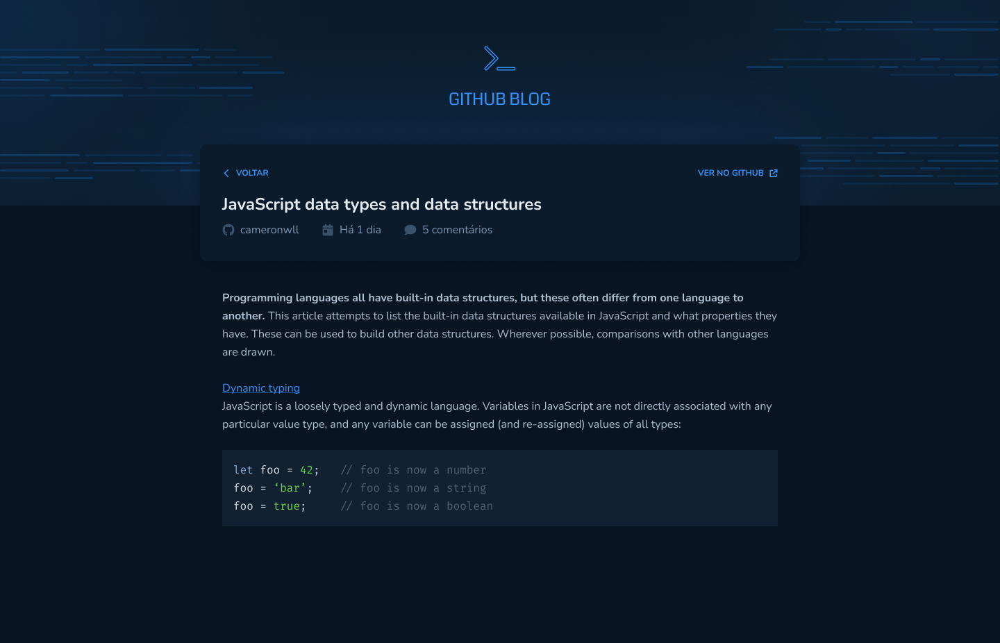

<h1 align="center">
  
</h1>

<h3 align="center">
  Web Application for Github Blog
</h3>

<p align="center">List your issues and profile user</p>

<p align="center">
  

  <a href="https://www.linkedin.com/in/ruan-ferreira-s/" target="_blank" rel="noopener noreferrer">
    
  </a>

  

  <a href="https://github.com/ruan4f/ignite-github-blog/commits/main">
    
  </a>

  <a href="https://github.com/ruan4f/ignite-github-blog/issues">
    
  </a>

  <a href="https://github.com/ruan4f/ignite-github-blog/blob/main/LICENSE">
    
  </a>
</p>

<p align="center">
  <a href="#-about-the-project">About the project</a>&nbsp;&nbsp;&nbsp;|&nbsp;&nbsp;&nbsp;
  <a href="#-technologies">Technologies</a>&nbsp;&nbsp;&nbsp;|&nbsp;&nbsp;&nbsp;
  <a href="#-getting-started">Getting started</a>&nbsp;&nbsp;&nbsp;|&nbsp;&nbsp;&nbsp;
  <a href="#-how-to-contribute">How to contribute</a>&nbsp;&nbsp;&nbsp;|&nbsp;&nbsp;&nbsp;
  <a href="#-license">License</a>
</p>

## ✅ About the project

This project is the third ignite Rocketseat challenge from the reactjs study platform.

The user can list your issues and profile user.

<h1 align="center">
  
</h1>

<h1 align="center">
  
</h1>

## 🚀 Technologies

Technologies that I used to develop this api

- [React JS](https://pt-br.reactjs.org/)
- [Vite JS](https://vitejs.dev/)
- [TypeScript](https://www.typescriptlang.org/)
- [Styled Components](https://styled-components.com/)
- [Axios](https://axios-http.com/)

## 💻 Getting started

**Clone the project and access the folder**

```bash
$ git clone https://github.com/ruan4f/ignite-github-blog.git && cd ignite-github-blog
```

**Follow the steps below**

```bash
# Install the dependencies
$ npm i

# To finish, run
$ npm run dev

# Well done, project is started!
```

## 🤔 How to contribute

**Make a fork of this repository**

```bash
# Fork using GitHub official command line
# If you don't have the GitHub CLI, use the web site to do that.

$ gh repo fork ruan4f/ignite-github-blog
```

**Follow the steps below**

```bash
# Clone your fork
$ git clone your-fork-url && cd ignite-github-blog

# Create a branch with your feature
$ git checkout -b my-feature

# Make the commit with your changes
$ git commit -m 'Feature: My new feature'

# Send the code to your remote branch
$ git push origin my-feature
```

After your pull request is merged, you can delete your branch

## 📝 License

This project is licensed under the MIT License - see the [LICENSE](LICENSE) file for details.

---

Made with 💚 by Ruan Ferreira 🤝 [See my linkedin](https://www.linkedin.com/in/ruan-ferreira-s/)
